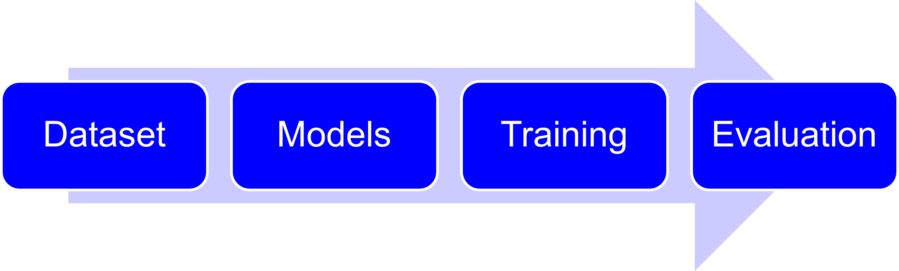

# Evaluation of Time Series Generative Models

The main objective of the project is to summarize the evaluation metrics used in unconditional generative models for synthetic data generation, list the advantages and disadvantages of each evaluation metric based on experiments on different datasets and models. 

## Test metrics
We include the following test metric in our code pipeline:
- Sig-W1 metric [1]: a generic metric for distribution induced by time series.  
- Metrics on marginal distribution [1]: to measure the fitting of generative models in terms of the fitting of the marginal distribution.  
- Metrics on dependency [1]: to measure the fitting of generative models in terms of correlation and autocorrelation.  
- Discriminative score [2]: to train a classifier to distinguish whether the sample is from the true distribution or synthetic distribution. The smaller the discriminative score, the better generator.  
- Predictive score [2]: train a sequence-to-sequence model to predict the latter part of a time series given the first part, using generated data, then evaluate the true data. Smaller losses, meaning the ability to predict, are better.  

We also provide a code pipeline that provides the implementation of well-known generative models, their corresponding training procedure, and model assessment using the evaluation test metrics described before. Also, we provide several datasets as examples to demonstrate how to utilize the pipeline. See the figure below for the workflow of our pipeline:

We list the datasets and models we have implemented in this repository:

## Datasets
We provide the following datasets for model testing:
- Autoregressive process;
- Geometric Brownian motion;
- Rough volatility model (rough Bergomi);
- Google stock data [2];
- Beijing air quality data [5].

## Models
We implement some popular models for time series generation including:
- Time-GAN [2];
- Recurrent Conditional GAN (RCGAN) [3];
- Time-VAE [4].

For detailed instructions on repository structure and usage, refer to [Codes/README.md](Codes/README.md).
## Reference
[1] Ni, H., Szpruch, L., Wiese, M., Liao, S. and Xiao, B., 2021. Sig-Wasserstein GANs for Time Series Generation.  
[2] Yoon, J., Jarrett, D. and Van der Schaar, M., 2019. Time-series generative adversarial networks. Advances in neural information processing systems, 32.  
[3] Esteban, C., Hyland, S.L. and Rätsch, G., 2017. Real-valued (medical) time series generation with recurrent conditional gans. arXiv preprint arXiv:1706.02633.  
[4] Desai A., Freeman C., Wang, Z.H., Beaver I., 2021 TimeVAE: A Variational Auto-Encoder For Multivariate Time Series Generation. arXiv preprint arXiv:2111.08095.  
[5] Zhang S., Guo B., Dong A., He J., Xu Z., and Chen S.X., 2017, Cautionary tales on air-quality improvement in Beijing. Proceedings of the Royal Society A: Mathematical, Physical and Engineering Sciences.

